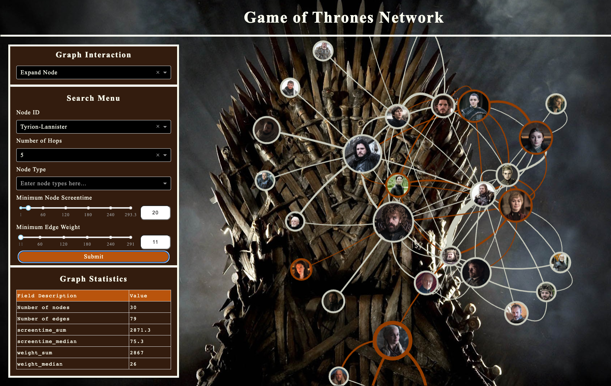

# awesome-dash-app
This repository was developed as an exploration into the capabilities of `dash` and `visdcc`, aimed at creating an interactive network visualization application. It contains code for a webpage with an interactive dashboard for a Game of Thrones character network, where it provides functionality to explore and analyze the connections between characters from the famous series.

<figure>
    
    <figcaption>Screenshot of the dashboard.</figcaption>
</figure>

## Features 

The dashboard has the following functionalities:
- **Character Search**: Enables a user to search for a specific character and viewits `n`-hop neighborhood, where `n` is chosen by the user. 
- **Screentime Filter**: Allows users to filter characters based on their screentime.
- **Edge/Relations Filter**: Provides the capability to filter relations or 'edges' based on their strength.

## Interactivity
A user can modify the network by deleting or expanding a node's neighborhood through a node. 
It also provides the capability of opening a character's wiki webpage when the corresponding node is clicked. 

## Technology Stack

The core components of the dashboard are [`jupyter_dash`](https://github.com/plotly/jupyter-dash) and [`visdcc`](https://github.com/jimmybow/visdcc). `jupyter_dash` is employed for the creation of the web application, while `visdcc` is used for the interactive network visualization.

The design and development of this dashboard were heavily inspired by [jaal](https://github.com/imohitmayank/jaal).

## Installation and Usage

To install and run the `awesome-dash-app`, follow the steps below. This guide assumes you're working in a Unix-like environment (like Linux or macOS). For Windows, the commands might slightly differ.

### Pre-requisites

- Python 3.x
- pip (Python package installer)
- A terminal

### Steps

1. **Clone the repository**

    Clone this repository to your local machine. Open your terminal and navigate to the location where you want the project to reside, then run the following command:
    ```
    git clone https://github.com/fredjo89/dash-app-playground.git
    ```
    Change into the project's root directory:
    ```
    cd awesome-dash-app
    ```

2. **Set up a virtual environment**

    Creating a virtual environment is recommended as it isolates the dependencies of this project from your global Python environment. Use the following command to create a new virtual environment named `my_venv`:
    ```bash
    python3 -m venv my_venv
    ```

3. **Activate the virtual environment**

    Before installing the project dependencies, activate the virtual environment with this command:
    ```bash
    source my_venv/bin/activate
    ```
    Your command prompt should now be prefixed with `(my_venv)`, indicating that you're working inside the virtual environment.

4. **Install dependencies**

    With the virtual environment activated, install the necessary dependencies using pip. This project includes a `requirements.txt` file that contains a list of all required Python packages. Install them using the following command:
    ```bash
    pip install -r requirements.txt
    ```

5. **Run the application**

    Now that all dependencies are installed, you can start the application using Python 3:
    ```bash
    python3 app.py
    ```
    The terminal will output an IP address once the application starts running.

6. **Access the application**

    Access the application by Command + left-clicking the IP address that was printed in the terminal. The application should open in your default web browser.

### Exiting the Application

To exit the application, return to the terminal and press `CTRL + C`. To deactivate the virtual environment, simply type `deactivate` and press `Enter`.


## Project Structure

Here's a brief overview of the main files and directories in this repository:

- `app.py`: The primary script that launches the application. It is dependent on `layout.py` and `callbacks.py`.

- `layout.py`: This script is responsible for defining the layout of the dashboard. It is dependent on `GraphData`.

- `callbacks.py`: This file manages user interactions by defining callback functions for the dashboard. These functions provide dynamic responses to user inputs such as clicks or selections. It also depends on `data/utils.py` and `GraphData`.

- `data/:`
This directory holds the data and the data-related back-end of the application. It loads raw data and executes all data operations to process and transform the data, feeding it to the front-end of the dashboard.
    - `raw_data`: This directory holds the raw data files for the character network. The data is stored in two separate CSV files: one containing node information, and the other detailing the edges or connections between nodes.
    - `graphdata.py`: Defines the class `GraphData` created to hold all data related to the dashboard. Depends on `dfgraph.py`, `load_data.py` and `utils.py`
    - `dfgraph.py`: Defines the class `DFGraph` created to hold a graph, which is the core component of `GraphData`. Depends on `utils.py`
    - `load_data.py`: This file contains the function that loads the data. 
    - `utils.py`: Defines some utility function used in other scripts in this folder.

- `assets/`: This directory is a storage for the images used in the dashboard, in addition to a `styles.css` file that defines the styles of the different components of the dashboard. 

- `download_portraits.py`: This utility script is used to download and process portrait images of the characters in the network. The output of this script populates the `assets/portrait_images` directory. While not essential to run in routine operations, it's necessary if the existing images disappear or modifications are required.

- `config.py`: This file defines the file paths which are used in other .py files. 